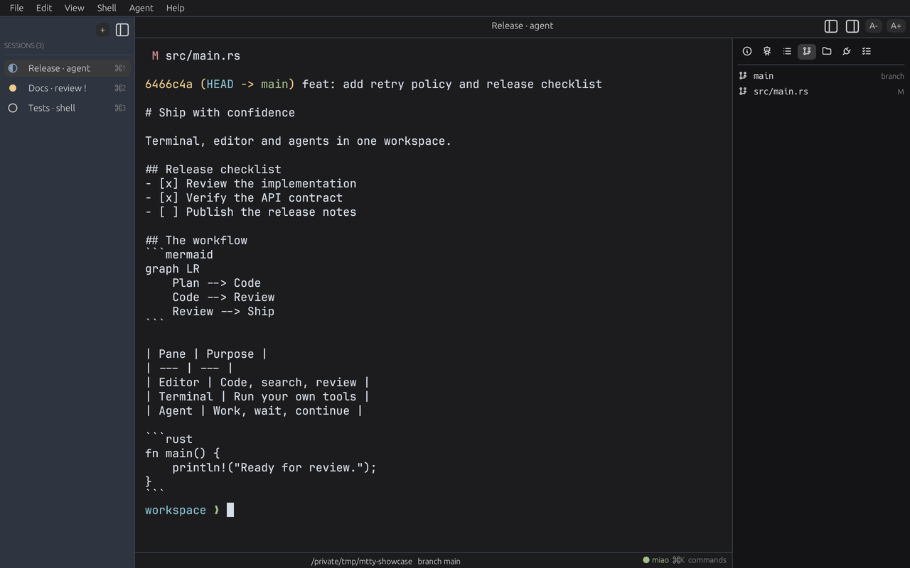
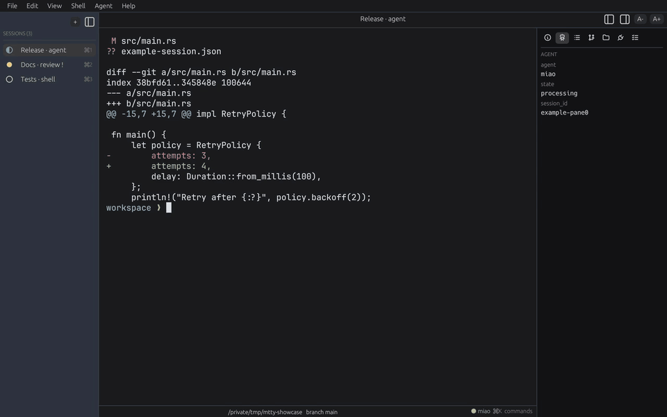
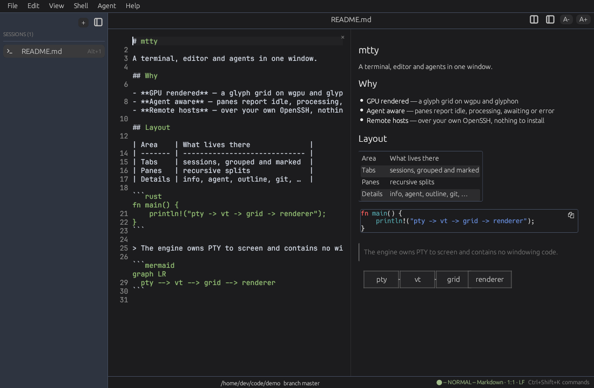
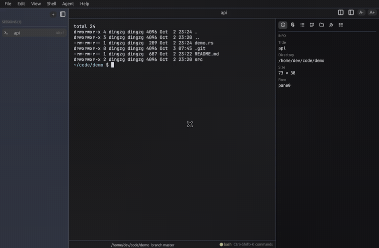
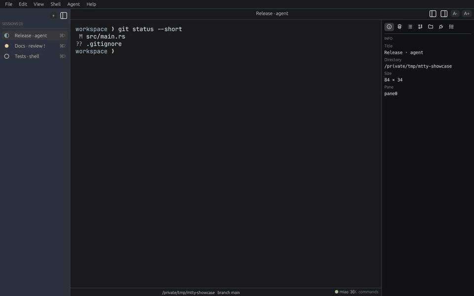
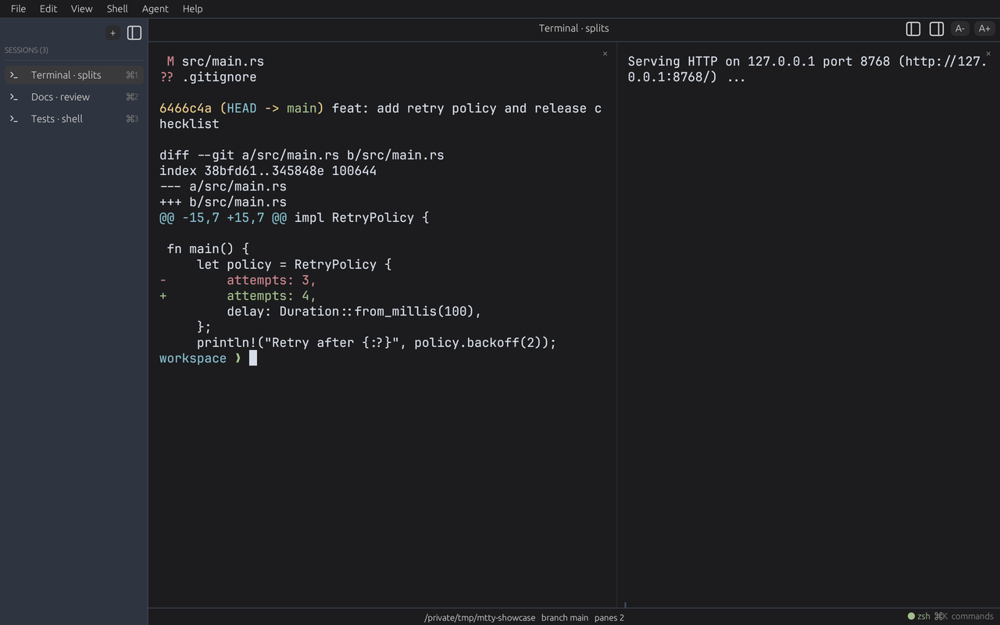

# miao-term

**mtty — an AI-native terminal and editor for local and remote work, written in Rust.**

[](https://github.com/oxdingzg/miao-term/actions/workflows/ci.yml)
[](LICENSE)
[](Cargo.toml)
[](#requirements)

**Website:** [mtty.dev/mtty](https://mtty.dev/mtty) · **Docs:** [mtty.dev/docs/mtty](https://mtty.dev/docs/mtty) · [Releases](https://github.com/oxdingzg/miao-term/releases) · [Related projects](#related-projects)

**English** · [简体中文](README.zh-CN.md)

---

## Overview

**mtty** puts your terminals, your files, your remote hosts and your AI coding
agents in one fast, native window. It is built on three pillars:

| Pillar | Today | Next |
|---|---|---|
| **Terminal and remote** — absorbs Termius and PuTTY | GPU-rendered terminal, tabs and splits, session restore; host library, keys, SFTP/FTP, port forwarding, jump hosts, snippets, broadcast input (over the system OpenSSH) | Serial, Telnet and raw TCP connections, `.ppk` keys; a Rust-native SSH stack is under consideration (needs an ADR) |
| **Editor** — a first-class text editor, not a side feature | Editor pane beside terminals: tree-sitter highlighting in 80 languages, files of any size (view mode above 64 MB), multiple cursors, find and replace with regex, go to line, a live Markdown and Mermaid preview pane; LSP diagnostics, hover, completion and go to definition | vim mode in the pane, folding and outline ([ADR 0034](docs/decisions/0034-editor-pane.md)) |
| **Agent workspace** — absorbs Superset, AI-native | State hooks for Claude Code, Codex, OpenCode and miao; attention badges and notifications; prompt queue; a git worktree per task with diff review; the MTP control plane | Agents' edits reviewed inline as undoable diffs; an ACP client; selections, diagnostics and terminal output as one-click agent context |

What ties them together: Rust and GPU rendering held to a performance gate;
terminal, editor, remote hosts and agents in the same tabs and splits; no
account, no forced cloud — mtty hosts the agents you choose and never calls a
model itself.

In this repository:

- a **terminal engine** — `miao-term-core` owns the hot path from the PTY to the
  screen and depends on no windowing or GPU code;
- an **editor core** — `miao-term-editor`, equally free of UI code;
- **`mtty`** — the application built on them, with tabs, panes, side panels, a
  settings window, shell integration and a scriptable control plane.

**`mtty` is the single application**, powered by the native `winit` +
`wgpu` host in `miao-term-widget`. `mtty-app` provides the executable and
installer metadata; the host draws the terminal directly and composites egui
chrome in the same frame. It includes picture-in-picture, hint mode, read-only
mode and per-pane close buttons.

> **Renamed from miaotty.** The application was called `miaotty` up to v0.0.5.
> mtty copies `~/.config/miaotty` on first start, reads `MIAOTTY_*` variables,
> still answers `miaotty://` links and the old socket path, and exports the
> old pane variables so installed hooks and miao keep working — see
> [ADR 0032](docs/decisions/0032-rename-mtty.md) and
> [application identity and migration](docs/APP-IDENTITY.md).

The engine and application remain deliberately decoupled for embedding.
See [`docs/ARCHITECTURE.md`](docs/ARCHITECTURE.md) for the full design.

## Screenshots

Terminals, files, remote hosts and agents in one window. Three tabs, each
badged with its agent's state, with the repository's own git log in the active
pane and the details panel beside it:



| Agent state, live | Editor and live preview |
|---|---|
|  |  |

| Command palette to a split | Details panels |
|---|---|
|  |  |

Recursive splits keep a git log and a running server side by side:



> **Project status — pre-release.** The version is `0.0.21` and the API is not yet
> stable. macOS is the primary platform. Windows is built, tested and driven over
> MTP on real hardware (see [`docs/WINDOWS-DEV.md`](docs/WINDOWS-DEV.md)); Linux
> builds and passes tests in CI and has been checked on a real GNOME/Wayland
> desktop (input method, menus, file drops, clipboard, shortcuts).

---

## Related projects

| Project | What it is | Links |
|---|---|---|
| **mtty** (this repository) | The AI-native terminal and editor, and the embeddable engines behind it | [mtty.dev/mtty](https://mtty.dev/mtty) · [oxdingzg/miao-term](https://github.com/oxdingzg/miao-term) |
| **miao** | Open-source AI coding agent for the terminal | [mtty.dev/miao](https://mtty.dev/miao) · [oxdingzg/miao](https://github.com/oxdingzg/miao) |
| **mtty.dev** | The website and documentation for both | [mtty.dev](https://mtty.dev) |

mtty and miao are separate projects, and each works without the other. Inside
an mtty pane, miao reports its state (working, waiting for you, done, error)
over the control plane; mtty badges the pane, notifies you when an agent needs
you, keeps the machine awake while one works and sends your queued prompt when
it goes idle. mtty also ships state hooks for other agent CLIs (Claude Code,
Codex, OpenCode).

Two things named *miaotty*: the application in this repository was called
`miaotty` up to v0.0.5 (see the rename note above), and
[oxdingzg/miaotty](https://github.com/oxdingzg/miaotty) is a separate, earlier
personal macOS prototype (a Ghostty fork) that is no longer developed — use
mtty instead.

## Features

**Terminal core**
- PTY-backed shells with VT parsing via `alacritty_terminal`.
- GPU glyph-grid rendering (`wgpu` + `glyphon`), reusing egui's device, queue
  and surface.
- Scrollback with a scrollbar indicator, drag and double-click selection,
  copy/paste, and wide-character / CJK layout with a system CJK font fallback.
- Files dropped on a terminal insert their shell-quoted paths; dropped on the
  band along its bottom (or with Option/Alt held) they open instead, files in
  the editor and a folder as a terminal there. Both targets show while
  dragging.
- Find (`⌘F`) with match highlighting and a result count, CJK included.
- The [kitty keyboard protocol](https://sw.kovidgoyal.net/kitty/keyboard-protocol/)
  (CSI-u, disambiguate level) when a program requests it, modifier-aware
  navigation keys, and F1–F12 / Insert as xterm sequences.

**Window and workspace**
- Otty-style frame: the session sidebar runs the full window height (icons,
  agent badges, `+`, drag to reorder); the row beside its header shows the
  active tab's title with the panel and font controls at the top right. On
  macOS the title bar is transparent, so the traffic lights sit in the sidebar
  header and that row moves the window (double-click zooms). With the sidebar
  hidden the row shows the inline tab bar (`+`, `×`, drag to reorder)
  instead. Right-clicking a tab or a session opens the same row menu: Rename
  Tab…, Prefix…, Mark…, Group…, Remove from Group (only inside a group),
  Duplicate Tab, Move Up/Down, New Tab, Close Tab, Close Other Tabs and
  Close Below, in mtty. A tab's mark is appended to its title and its group
  is kept with the session, so both survive a restart. The session list and tab bar draw
  a divider where the group changes. Close Tab, the tab's `×` and session-row middle-click
  close the whole tab, including its splits; the last tab is kept alive.
  `⌘W` / `Ctrl+W` retains the focused-pane close behavior when a tab is split.
- Both side panels can be resized by dragging their edge; the widths are kept
  with the window size.
- A recursive split tree: `⌘D` splits right and `⇧⌘D` splits down, with
  draggable dividers and a close button on every pane. `⌘⇧T` toggles a scratch
  Quick Terminal.
- A **file list** in the details panel's Files tab (a click opens the reader)
  and **View rules** that map a pane's directory, foreground command, agent or
  ssh host to an alias, icon, tab title and badge, reloaded when `views.json`
  changes — see [`docs/VIEW-RULES.md`](docs/VIEW-RULES.md).
- A **command palette** (`⌘K`) and **Open Quickly** (`⌘⇧O`) over tabs, agents,
  files and directories in the current folder, and recent files.
- A right-hand details panel with tabs: **Info, Agent, Outline, Git, Files,
  Ports, Queue** (git status, directory listing, listening ports, prompt queue).
- **Composer** (`⌘E`, `Ctrl+Shift+E` on Linux/Windows) and a **prompt queue**: a queued prompt targets the pane
  it was queued from and is typed in when that pane's agent turns idle, one per
  transition (it survives restarts; Send now takes it out of the queue);
  **notifications** and a **sleep guard** driven by agent state. Background tabs
  are marked when their agent needs input or failed (`!`), finished (✓) or
  printed something (•); bringing mtty forward soon after a notification shows
  the pane it was about.
- **Reader/editor**: read-only preview with line numbers, edit mode with a
  gutter and an opt-in minimal vim mode (`editor-vim`). A failed save is shown
  and keeps the buffer modified; closing unsaved changes asks for a second
  close. A CommonMark renderer (`egui_commonmark`): headings, lists, quotes,
  tables, code, links, remote images, plus `graph`/`flowchart`,
  `sequenceDiagram`, `stateDiagram`, `classDiagram`,
  `erDiagram` and `pie` Mermaid subsets (or full Mermaid via
  `mermaid-command`).
- **Inline terminal graphics**: Sixel, Kitty and iTerm2 images are drawn in the
  grid by mtty — they scroll with the content and are clipped to the pane.
  Toggle with `graphics` (on by default).
- **Agent tasks**: *New Agent Task…* creates a git worktree and branch
  (`<repo>/.worktrees/<name>`, `mtty/<name>`) with its own tab and, optionally,
  an agent started in it; *Agent Tasks…* lists them with Open, Diff (including
  uncommitted work), Merge into the base branch and Discard (both confirmed).
  Git runs in the background and nothing tracked in the repository changes.
- **Recipes**: save and replay a whole workspace.
- A settings window (`⌘,`): font size/family, opacity, line height, cursor
  style, theme, inline graphics, notifications, sleep guard and agent hook
  installation. Changed values are written back to `config.toml` when the window
  closes, keeping comments and other keys; a `config.toml` that fails to parse is
  reported in the status line and never overwritten.

**Configuration and integration**
- Configuration at `~/.config/mtty/config.toml`: font size, font family,
  opacity, line height, cursor style, theme, colors, `language` (English or
  Simplified Chinese), `editor`, agent toggles, `quick-terminal-hotkey`,
  `update-check-url` / `update-pubkey` — see
  [`docs/config.example.toml`](docs/config.example.toml).
- Automatic import of ghostty `config` and alacritty `alacritty.toml` when no
  mtty config exists.
- Shell integration for zsh, bash, fish and PowerShell (cwd via OSC 7, command
  history, OSC 133 command boundaries), installed through a shim per shell — the
  user's dotfiles are never modified. With it, *Copy Last Command Output* and *Send Last Command Output to
  Composer* take exactly the last command's output (with its exit status).
- **URL schemes**: `mtty://`, `ssh://` and `x-man-page://` open a tab with the
  matching command; a second launch — of mtty — is forwarded to the
  running instance (single instance, including "focus pane" and "quick"
  intents) through a shared inbox beside the control socket, and a plain second
  launch brings the window forward. URLs arrive as command-line arguments;
  macOS URL events from a browser or Finder are not handled yet.
- **Global Quick Terminal hotkey**: `global-hotkey` on macOS/Windows, the
  external compositor bindings on Linux (sway/hyprland/GNOME and friends).
- **Native menu bar on macOS**: the installed `.app` shows File/Edit/View/Shell/
  Agent/Help in the system menu bar — with About/Services/Hide/Quit — and the
  window has no menu strip of its own, like every other macOS terminal
  (ADR 0031). A bare `mtty` binary keeps the in-window menu. The window
  itself asks for the dark appearance, so its title bar matches the chrome
  instead of opening as a light strip.
- **Agent integrations**: detect claude/codex/opencode/miao and launch them in a
  new tab (Settings or the command palette); install a state hook script and
  copy a ready-to-merge config — `hooks` JSON for Claude Code
  (`~/.claude/settings.json`) and codex (`~/.codex/hooks.json`), a plugin file
  for opencode. The user's agent config is never edited for them, and hooks
  only report for agents running inside an mtty pane. `miao` reports its state
  from a built-in integration, so it needs no hook wiring.
- **Updates**: *Check for Updates* reads the version manifest; *Download
  Update* fetches this platform's package and checks its SHA-256 and its
  minisign signature in process (against the release key built into mtty, or
  `update-pubkey`); an unsigned or mismatching download is deleted and never
  installed. *Install and Relaunch* (or the palette's *Update and Relaunch*,
  all steps at once) replaces the macOS app with a rollback if the swap fails,
  a running AppImage, or runs the Windows MSI; deb and tarball installs open
  the verified download for the package manager.
- **Host library**: hosts saved in `~/.config/mtty/hosts.toml` (name, address,
  user, port, group, tags, jump host) are listed in the sidebar and in Open
  Quickly; *Hosts…* searches, adds, deletes (confirmed) and imports the concrete
  `Host` entries of `~/.ssh/config`, which then connect by alias so every option
  ssh has for them applies. `mtty://host/<name>` connects from a script or
  launcher. No passwords or keys are stored. *Hosts…* also shows the ssh agent's
  keys, checks a host's key against `known_hosts` (unknown keys show their
  fingerprints to compare before trusting; a changed key is refused), and runs
  `ssh-keygen` / `ssh-copy-id` in a terminal tab. Each host keeps port forwards
  (`-L`, `-R`, `-D` SOCKS) that start and stop from there and show whether they
  run or why ssh gave up; the status line counts them.
- **SSH sessions and remote view/edit**: *New SSH Session…* honours
  `~/.ssh/config`, reuses a ControlMaster connection and bootstraps terminfo with
  nothing installed remotely; *View/Edit Remote File…* reads and writes over that
  connection (the host of the active ssh tab is filled in).
- **Serial, Telnet and raw TCP**: *New Serial/Telnet/TCP Session…* opens a serial
  console (device, baud, data bits, parity, stop bits, flow), a Telnet connection
  or a raw TCP socket as a pane. Saved hosts carry a `kind` and open the same way;
  Telnet and raw TCP are marked unencrypted (ADR 0037).
- **PuTTY keys**: *Hosts… → Import PuTTY Key…* reads a `.ppk` (v2 or v3,
  Ed25519/RSA/ECDSA) and writes an encrypted OpenSSH key to `~/.ssh`, never
  storing it unencrypted (ADR 0038).
- **ACP agents**: any agent that speaks the Agent Client Protocol (Codex,
  Gemini CLI, …) runs from *ACP Agent…*: a transcript window streams its
  replies, sends prompts, turns its diffs into reviewable editor proposals and
  asks for permission with Allow/Deny. Agents are listed under `[acp]` in
  `config.toml` (ADR 0040).
- **FTP/FTPS**: *Connect over FTP/FTPS…* opens the same two-pane browser
  through the system `curl` (explicit TLS by default; plain FTP is marked as
  unencrypted). The password stays in memory; leave it empty to use
  `~/.netrc` or log in anonymously.
- **Persistent sessions**: per saved host, *Keep the shell in tmux* reattaches
  the same session on reconnect, and *Connect with mosh* survives sleep and
  network changes (mosh needed on both ends; mtty falls back to ssh without it, and always on
  Windows, which has no native mosh client).
- **Encrypted sync (optional, off by default)**: *Sync Hosts and Snippets…*
  writes hosts and snippets, encrypted, to a folder you already sync (iCloud
  Drive, Dropbox, Syncthing). No account and no server; the key stays in
  `~/.config/mtty/sync.key` and a second device joins with its pairing code
  (ADR 0033).
- **Snippets and broadcast**: *Snippets…* keeps commands in
  `~/.config/mtty/snippets.toml` (name, command, tags) to run in the current
  pane or on several saved hosts (a tab each); Open Quickly finds them too.
  *Broadcast Input to All Panes in Tab* types into every split at once (the
  status line says BROADCAST).
- **SFTP**: a two-pane file browser (this machine | the host) from Hosts, the
  palette for the active ssh tab, or `mtty://sftp/<name>`: browse, upload
  (also by dropping files on the window), download with progress, rename,
  chmod, new folder and delete (confirmed). It drives the system `sftp`, so ssh
  config, jump hosts, the agent and the shared connection apply.

**Automation**
- The **MTP control plane** over a per-user Unix socket (a named pipe on
  Windows): `core.ping/health`, `agent.state.*`, `history.*`,
  `pane.list/send/run/focus/close`, `pane.output` (the last command's output;
  capability `pane.read`), `app.view/edit` (open a file in the app) and
  `file.read/write` (bounded to 2 MB).
- **`mtty-cli`**, a cross-platform client for the control plane.

---

## Architecture

The engine is layered so that dependencies point inward only
(`host → render → core`), with reusable UI helpers above the engine.

| Crate | Responsibility |
|-------|----------------|
| [`miao-term-core`](crates/term-core) | PTY, VT parsing, grid/scrollback, selection, search, OSC, input encoding. No GPU or windowing. |
| [`miao-term-graphics`](crates/term-graphics) | Inline-graphics stream scanner and decoders (Sixel, Kitty, iTerm2). |
| [`miao-term-render`](crates/term-render) | `wgpu` + `glyphon` glyph-grid renderer, quad and image pipelines. |
| [`miao-term-ui`](crates/term-ui) | Host-agnostic UI shared by mtty: theme, input encoding, selection, split layout, egui chrome, palette, hints, vim, markdown, ssh, update and agent-integration helpers. |
| [`miao-term-editor`](crates/term-editor) | Editing core for the editor pane: rope buffer, transactions and undo, multiple selections, motions, search and replace (ADR 0034). No UI code. |
| [`miao-term-lsp`](crates/term-lsp) | Language Server Protocol client for the editor pane: servers per workspace on background threads, document sync, diagnostics, hover, completion, definitions (ADR 0034). No UI code. |
| [`miao-term-config`](crates/term-config) | Configuration and themes, ghostty/alacritty import, and the View-rule engine. |
| [`miao-term-mtp`](crates/term-mtp) | MTP protocol, host/client and transport (Unix socket, Windows named pipe, TCP). |
| [`miao-term-widget`](crates/term-widget) | The native host library for mtty: `winit` + `wgpu` render loop that draws the grid directly and composites the egui chrome. |
| [`mtty-app`](mtty-app) | The `mtty` native executable and platform packaging metadata. |
| [`mtty-cli`](mtty-cli) | The `mtty-cli` control client. |

The hot path — `pty → vt → grid → renderer` — takes no locks and allocates
nothing per frame. Platform differences are confined to small `#[cfg]`-guarded
blocks in the crate that owns the concern: PTY spawning in `term-core`
(`src/term.rs`), the window/event loop in `term-widget` (`src/lib.rs`), and the
socket/named-pipe transport in `term-mtp` (`src/lib.rs`).

### Principles

1. Engine and hosts are separate; the hosts are the engine's first consumers.
2. The hot path takes no locks and allocates nothing.
3. Build the application first, extract the library later — APIs are driven by real needs.
4. OS differences are confined to `#[cfg]`-guarded blocks in `term-core`, `term-widget` and `term-mtp`.
5. The control plane (MTP / CLI) is decoupled from the engine.

---

## Requirements

- The Rust **stable** toolchain (pinned in [`rust-toolchain.toml`](rust-toolchain.toml); MSRV 1.80).
- A GPU and driver supporting Metal (macOS), Vulkan (Linux) or DX12 (Windows).
- On Linux, the usual `winit`/`wgpu` system libraries (X11 or Wayland development
  packages) must be available.

---

## Getting started

```sh
git clone https://github.com/oxdingzg/miao-term.git
cd miao-term

# Build and run the terminal (either host)
cargo run --release -p mtty-app
```

The first build compiles `wgpu`/`glyphon` and may take a few minutes.

### Testing and linting

```sh
cargo test --workspace
cargo clippy --workspace --all-targets
cargo fmt --all -- --check
```

CI (`.github/workflows/ci.yml`) runs on every push, PR and nightly. On pushes it
runs `cargo fmt --check`, `cargo clippy --workspace --all-targets -D warnings`,
`cargo check` on Linux and macOS, and the privacy scan; the full three-OS
`cargo test --workspace`, the Linux software-Vulkan render test, the Windows job
and the release-mode performance gate run on pull requests, the nightly schedule
and manual dispatches. Docs-only pushes skip the compile and lint jobs.

### Packaging

```sh
scripts/package-macos.sh          # -> dist/mtty.app (ad-hoc signed)
```

Release builds are produced by [`.github/workflows/release.yml`](.github/workflows/release.yml)
on `v*` tags: `mtty` and `mtty-cli`, the  the macOS
app bundle, a Linux `.deb`/AppImage and a Windows MSI.
[`dist-workspace.toml`](dist-workspace.toml) is a
[cargo-dist](https://opensource.axo.dev/cargo-dist/) scaffold. See
[`docs/INSTALL.md`](docs/INSTALL.md) and [`docs/RELEASE.md`](docs/RELEASE.md).

---

## Configuration

mtty reads `~/.config/mtty/config.toml` (or
`$XDG_CONFIG_HOME/mtty/config.toml`; on Windows `%APPDATA%\mtty\config.toml`).
Every key is optional, and if no mtty configuration exists, ghostty's `config`
and alacritty's `alacritty.toml` are imported automatically.

```toml
font-size = 13
theme     = "nord"
```

[`docs/CONFIG.md`](docs/CONFIG.md) has the keys, the editor and ACP sections,
and shell integration; [`docs/config.example.toml`](docs/config.example.toml)
is every key with its default in one file.

---

## Control plane

The **MTP** (mtty terminal protocol) control plane speaks newline-delimited
JSON over a per-user socket (`$XDG_RUNTIME_DIR/mtty.sock`, falling back to
`$TMPDIR`), created with owner-only permissions. Every response carries a state
`revision`, so a client waits on it or subscribes to an event stream instead of
polling. `mtty-cli` is the reference client:

```sh
mtty-cli pane list
mtty-cli pane run --pane ID --data "echo hello"
mtty-cli events --topic agent.state
mtty-cli wait --since 42
mtty-cli state claude --state processing --pane ID
```

[`docs/CLI.md`](docs/CLI.md) has the full command set, the state-revision and
event model, remote access over TCP, and the token and capability allowlist.

---

## Keyboard shortcuts

`⌘T` opens a tab, `⌘D` / `⇧⌘D` splits, `⇧⌘O` is Open Quickly, `⌘K` the command
palette and `⌘F` find. On Linux and Windows plain `Ctrl` chords (`Ctrl+C`,
`Ctrl+W`, `Ctrl+D`, …) always reach the shell, and `Super`/`Win` combinations
are left to the desktop.

[`docs/SHORTCUTS.md`](docs/SHORTCUTS.md) has the full tables, including the
editor pane's own bindings.

---

## Documentation

Documentation is written in English by default, with a Simplified Chinese
version kept in sync as `*.zh-CN.md`.

| Document | English | 简体中文 |
|----------|---------|---------|
| Architecture & design | [`docs/ARCHITECTURE.md`](docs/ARCHITECTURE.md) | [`docs/ARCHITECTURE.zh-CN.md`](docs/ARCHITECTURE.zh-CN.md) |
| Architecture decision records | [`docs/decisions/`](docs/decisions/README.md) | [`docs/decisions/README.zh-CN.md`](docs/decisions/README.zh-CN.md) |
| Installation | [`docs/INSTALL.md`](docs/INSTALL.md) | [`docs/INSTALL.zh-CN.md`](docs/INSTALL.zh-CN.md) |
| Configuration | [`docs/CONFIG.md`](docs/CONFIG.md) | [`docs/CONFIG.zh-CN.md`](docs/CONFIG.zh-CN.md) |
| The `mtty-cli` control plane | [`docs/CLI.md`](docs/CLI.md) | [`docs/CLI.zh-CN.md`](docs/CLI.zh-CN.md) |
| Keyboard shortcuts | [`docs/SHORTCUTS.md`](docs/SHORTCUTS.md) | [`docs/SHORTCUTS.zh-CN.md`](docs/SHORTCUTS.zh-CN.md) |
| Troubleshooting | [`docs/TROUBLESHOOTING.md`](docs/TROUBLESHOOTING.md) | [`docs/TROUBLESHOOTING.zh-CN.md`](docs/TROUBLESHOOTING.zh-CN.md) |
| View rules (titles/icons/badges) | [`docs/VIEW-RULES.md`](docs/VIEW-RULES.md) | [`docs/VIEW-RULES.zh-CN.md`](docs/VIEW-RULES.zh-CN.md) |
| Performance budgets & gate | [`docs/PERFORMANCE.md`](docs/PERFORMANCE.md) | [`docs/PERFORMANCE.zh-CN.md`](docs/PERFORMANCE.zh-CN.md) |
| Windows dev/verification | [`docs/WINDOWS-DEV.md`](docs/WINDOWS-DEV.md) | [`docs/WINDOWS-DEV.zh-CN.md`](docs/WINDOWS-DEV.zh-CN.md) |
| Product requirements & roadmap | [`docs/PRODUCT.md`](docs/PRODUCT.md) | [`docs/PRODUCT.zh-CN.md`](docs/PRODUCT.zh-CN.md) |
| Releasing & updates | [`docs/RELEASE.md`](docs/RELEASE.md) | [`docs/RELEASE.zh-CN.md`](docs/RELEASE.zh-CN.md) |
| Working agreement (privacy, checks) | [`AGENTS.md`](AGENTS.md) | — |
| Example configuration | [`docs/config.example.toml`](docs/config.example.toml) | — |

---

## Roadmap

The product direction for **mtty**, the
verified feature baseline and the milestone plan live in
[`docs/PRODUCT.md`](docs/PRODUCT.md).

Next milestones:

- **M5 Editor pane** ([ADR 0034](docs/decisions/0034-editor-pane.md)): E1, the
  `term-editor` core, is done; next the pane itself, then tree-sitter
  highlighting, multi-cursor and find/replace, LSP, and a vim mode.
- **M6 Remote, PuTTY-style**: serial, Telnet and raw TCP sessions, `.ppk` key
  import; whether to move SSH to a Rust-native stack is an open design
  question.
- **M7 AI-native workspace**: agents' edits reviewed inline as undoable diffs,
  an ACP client, and selections, diagnostics and terminal output sent to an
  agent in one step.

Done recently: the Windows named-pipe transport and ConPTY path (verified on
real hardware), session restore, View rules, Open Quickly, the details panels,
the agent loop (notifications, sleep guard, prompt queue), recipes, remote
view/edit over ssh, version checks, URL schemes, the global
Quick Terminal hotkey and IME preedit in mtty, inline graphics in mtty, Mermaid sequence/state/class/ER/pie diagrams, the MTP event stream, i18n,
and a performance gate. The CI performance baseline is persisted at
`benches/perf-baseline.json` and refreshed by nightly/manual runs; comparison is
report-only, with absolute budgets enforced.

Still open:

- **Release acceptance**: releases are built on four runners, signed with
  minisign and published with an update manifest (latest: v0.0.21). Updating an
  installed app through Software Update still needs an end-to-end check on each
  desktop; **Apple notarization** and **Windows MSI signing** require
  credentials. See [`docs/RELEASE.md`](docs/RELEASE.md).
- **Not designed yet**: agent Resume and quota display, jump-to-line highlight,
  Open Externally.
- **Platform verification (needs hardware)**: the Linux wgpu render path runs in
  CI via Mesa software Vulkan (lavapipe) and Windows is driven over MTP on real
  hardware; a real Linux desktop session, the Wayland portal hotkey and the
  Windows IME/GUI paths still need an interactive machine.
- **Update install**: the macOS swap is checked end to end with a packaged app
  and a test-signed release (and tampered packages are refused); the AppImage and
  Windows helpers are unit-tested, not yet run on those desktops.
- **Single native application**: mtty replaces the former dual-host release;
  see [APP-IDENTITY.md](docs/APP-IDENTITY.md).

- **Inline graphics**: Kitty z-index is not modelled (images paint over the
  grid); anchors are exact up to the scrollback cap and approximate past it
  (alacritty exposes no scroll counter without a patch), and session restore
  keeps no images (they would not match the restored content).
- **Mermaid**: the built-in subset covers `graph`/`flowchart`,
  `sequenceDiagram`, `stateDiagram`, `classDiagram`, `erDiagram` and `pie`;
  gantt, journey, git graphs and the rest fall back to `mermaid-command` or a
  placeholder.
- **i18n**: the chrome, palette, settings and dialogs are covered; a few
  example/agent strings stay English on purpose.

---

## Contributing

Contributions are welcome. Before opening a pull request:

1. Run `cargo fmt --all`, `cargo clippy --workspace --all-targets` and
   `cargo test --workspace`.
2. Keep documentation bilingual: when you change a `doc`, update its
   `doc.zh-CN.md` counterpart in the same change (for example `README.md` /
   `README.zh-CN.md`, or `docs/RELEASE.md` / `docs/RELEASE.zh-CN.md`).
3. For changes to a *locked* design decision, add an ADR under
   [`docs/decisions/`](docs/decisions/README.md) rather than editing the record
   in place.

By contributing, you agree that your contributions are licensed under the
project's license (Apache-2.0).

---

## License

Licensed under the [Apache License, Version 2.0](LICENSE).
